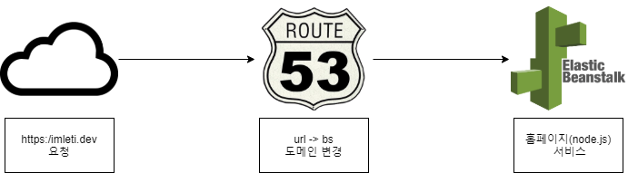

# homepage_structure
현재 홈페이지 구현된 구조 메모

## 대략적 구조

### Route 53

- 요청 도메인에 대해 특정 서비스로 라우팅 기능이 있음.
- 현재 beanstalk 어플리케이션으로 라우팅 되도록 설정되어 있음.

### Elastic Beanstalk

- 웹 어플리케이션 / 서비스를 간편하게 배포하고 조정할 수 있는 서비스.
- 코드 업로드 하기만 하면 알아서 용량 조절, 크기 조정, 어플리케이션 상태 모니터링 등 배포를 자동으로 처리함.
- 추가비용 없이 어플리케이션을 저장 / 실행하는데 필요한 리소스에 대해서만 요금을 지불하면됨.
- .Net, Java, PHP, Node.js, Python, Ruby, Go, Docker... 다양한 언어 지원.

